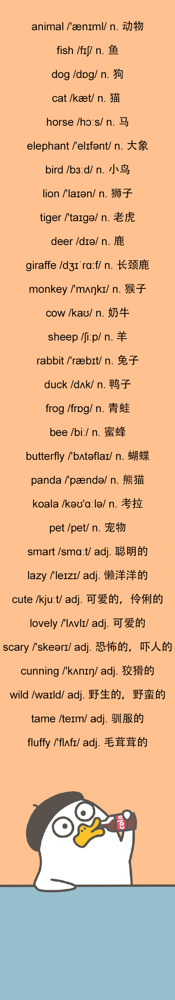

animal
======

/'ænɪml/

n. 动物  

pet
===

/pet/

n. 宠物

\-What animals do you like?

\-I like elephants.

\-你喜欢什么动物？

\-我喜欢大象。

fish
====

/fɪʃ/

n. 鱼

I finally caught a fish.

我终于钓到了一条鱼。

dog
===

/dɒg/

n. 狗

Your dog is really cute, Peter!

彼得，你家的狗好可爱呀！

cat
===

/kæt/

n. 猫

My mom has a big cat.

我妈妈养了一只大猫。

horse
=====

/hɔːs/

n. 马

I like this horse.

我喜欢这匹马。

elephant
========

/'elɪfənt/

n. 大象

Elephants are the largest land animals on the Earth.

大象是地球上最大的陆地动物。

  

bird
====

/bɜːd/

n. 小鸟

The birds are singing.

小鸟们正在唱歌。

lion
====

/'laɪən/

n. 狮子

Alice came across a lion.

爱丽丝遇到了一只狮子。

tiger
=====

/'taɪgə/

n. 老虎

Which animal do you like better, tiger or lion?

你更喜欢哪种动物呢，老虎还是狮子?

deer
====

/dɪə/

n. 鹿

The tiger, elephant, and deer are all my friends.

老虎、大象、鹿都是我的朋友。

giraffe
=======

/dʒɪˈrɑ:f/

n. 长颈鹿

The tiger, elephant, bear, giraffe are all my friends.

老虎、大象、熊、长颈鹿都是我的朋友。

monkey
======

/'mʌŋkɪ/

n. 猴子

I hate that monkey!

我讨厌那只猴子！

cow
===

/kaʊ/

n. 奶牛

We can get milk from cow.

我们能从奶牛那里得到牛奶。

sheep
=====

/ʃiːp/

n. 羊

  

He had some sheep on that farm.

在那农场里他有一些绵羊

  

rabbit
======

/'ræbɪt/

n. 兔子

Do you like tiger or rabbit?  

你喜欢老虎还是兔子呢？

duck
====

/dʌk/

n. 鸭子

I see a yellow duck looking at me.

我看到一只黄鸭在看着我。

frog
====

/frɒg/

n. 青蛙

Frog can live both on land and in water.

青蛙既能生活在陆地上也能生活在水中。

bee
===

/biː/

n. 蜜蜂

She is as busy as a bee in the morning.

早上她总是像蜜蜂一样忙得团团转.

butterfly
=========

/'bʌtəflaɪ/

n. 蝴蝶

People like butterflies because they are beautiful.

人们喜欢蝴蝶，因为蝴蝶们很漂亮。

  

panda
=====

/'pændə/

n. 熊猫

Pandas like bamboo.

熊猫喜欢竹子。

  

koala
=====

/kəʊ'ɑːlə/

n. 考拉

Koalas usually sleep 20 hours per day.

考拉通常一天睡20个小时的觉。

接下来，我们一起看一组形容词：  

smart
=====

/smɑːt/

adj. 聪明的

lazy
====

/'leɪzɪ/

adj. 懒洋洋的

cute
====

/kjuːt/

adj. 可爱的，伶俐的

lovely
======

/'lʌvlɪ/

adj. 可爱的

scary
=====

/'skeərɪ/

adj. 恐怖的，吓人的

cunning
=======

/'kʌnɪŋ/

adj. 狡猾的

wild
====

/waɪld/

adj. 野生的，野蛮的

tame
====

/teɪm/

adj. 驯服的

fluffy
======

/'flʌfɪ/

adj. 毛茸茸的

  

**今日词单**

